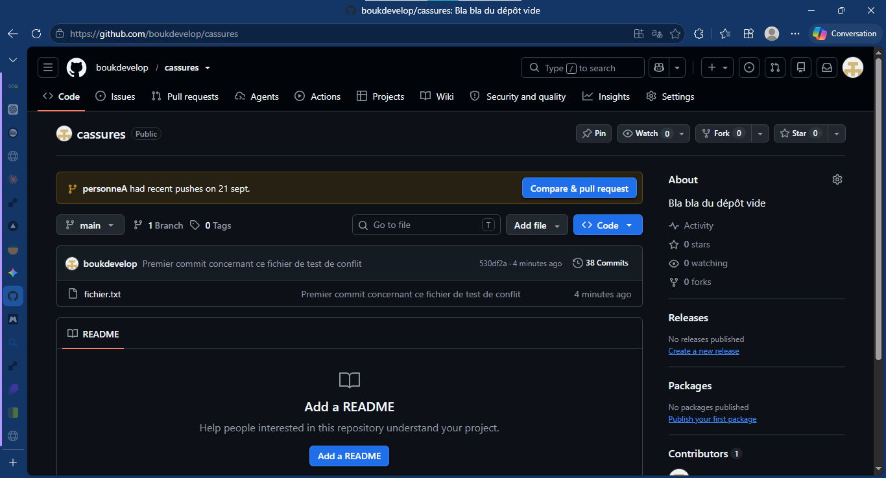

> # Le conflit résolue en direct

***Énoncé ***
Provoquez un conflit devant la classe, et résolvez-le sans couper : lecture des marqueurs, décision, reconstruction, validation. Ce qu'on évalue est le calme.
--

Pour mener à bien cette exercice, j'ai décidé de créer deux branches qui représenterons deux personnes.

Ainsi donc,

## Phase 1: Création de la situation de conflit (Mise en place) :

Avant de résoudre le conflitn, il faut biensûr le provoquer :

```bash
# S'assurer d'être sur la branche principale
FRANCK@DESKTOP-9ABFSKK MINGW64 ~/Desktop/cassures/cassures (main)
$ git checkout main
Already on 'main'
Your branch is up to date with 'origin/main'.

# 2. Création et modification du fichier de test de conflit
FRANCK@DESKTOP-9ABFSKK MINGW64 ~/Desktop/cassures/cassures (main)
$ echo "Ligne de début, celle que j'ai modifier par la suite" > fichier.txt

FRANCK@DESKTOP-9ABFSKK MINGW64 ~/Desktop/cassures/cassures (main)
$ git add fichier.txt
warning: in the working copy of 'fichier.txt', LF will be replaced by CRLF the n
ext time Git touches it
g
FRANCK@DESKTOP-9ABFSKK MINGW64 ~/Desktop/cassures/cassures (main)
$ git commit -m "Premier commit concernant ce fichier de test de conflit"
[main 530df2a] Premier commit concernant ce fichier de test de conflit
 1 file changed, 1 insertion(+)
 create mode 100644 fichier.txt

FRANCK@DESKTOP-9ABFSKK MINGW64 ~/Desktop/cassures/cassures (main)
$ git push origin main
Enumerating objects: 4, done.
Counting objects: 100% (4/4), done.
Delta compression using up to 4 threads
Compressing objects: 100% (2/2), done.
Writing objects: 100% (3/3), 329 bytes | 164.00 KiB/s, done.
Total 3 (delta 0), reused 0 (delta 0), pack-reused 0 (from 0)
To https://github.com/boukdevelop/cassures.git
   173a554..530df2a  main -> main
```

---

```bash
# 3. Création de la première branche (personneA) et modifiez la ligne
FRANCK@DESKTOP-9ABFSKK MINGW64 ~/Desktop/cassures/cassures (main)
$ git checkout -b personneA

FRANCK@DESKTOP-9ABFSKK MINGW64 ~/Desktop/cassures/cassures (personneA)
$ echo "Ligne 1 avec modification apportées à la première ligne" > fichier.txt

FRANCK@DESKTOP-9ABFSKK MINGW64 ~/Desktop/cassures/cassures (personneA)
$ git add fichier.txt

FRANCK@DESKTOP-9ABFSKK MINGW64 ~/Desktop/cassures/cassures (personneA)
$ git commit -am "Modification apportée par la première personne"

FRANCK@DESKTOP-9ABFSKK MINGW64 ~/Desktop/cassures/cassures (personneA)
$ git push origin personneA

# Désolé si vous ne voyez pas les résultats de ces commandes, j'ai taper la commande clean trop tôt
```

[](./image.png).

```bash
FRANCK@DESKTOP-9ABFSKK MINGW64 ~/Desktop/cassures/cassures (personneA)
$ git checkout main
Switched to branch 'main'
Your branch is up to date with 'origin/main'.

FRANCK@DESKTOP-9ABFSKK MINGW64 ~/Desktop/cassures/cassures (main)
$ git checkout -b personneB
Switched to a new branch 'personneB'

FRANCK@DESKTOP-9ABFSKK MINGW64 ~/Desktop/cassures/cassures (personneB)
$ echo "Ligne 1: Modification de la même ligne que pour les précédents" > fichier.txt

FRANCK@DESKTOP-9ABFSKK MINGW64 ~/Desktop/cassures/cassures (personneB)
$ git add fichier.txt
warning: in the working copy of 'fichier.txt', LF will be replaced by CRLF the n
ext time Git touches it

FRANCK@DESKTOP-9ABFSKK MINGW64 ~/Desktop/cassures/cassures (personneB)
$ git commit -am "Modification apportée par la première personne (B)"
[personneB a65cccd] Modification apportée par la première personne (B)
 1 file changed, 1 insertion(+), 1 deletion(-)

FRANCK@DESKTOP-9ABFSKK MINGW64 ~/Desktop/cassures/cassures (personneB)
$ git push origin personneB
Total 0 (delta 0), reused 0 (delta 0), pack-reused 0 (from 0)
remote:
remote: Create a pull request for 'personneB' on GitHub by visiting:
remote:      https://github.com/boukdevelop/cassures/pull/new/personneB
remote:
To https://github.com/boukdevelop/cassures.git
 * [new branch]      personneB -> personneB
```

---

Maintenant, vous avez deux branches (feature-A et feature-B) qui ont modifié la même ligne différemment à partir du même commit de départ.

## Phase 2: Déclenchement du conflit

Il faut fusonner `personneA` & `personneB` pour provoquer le conflit

```bash
FRANCK@DESKTOP-9ABFSKK MINGW64 ~/Desktop/cassures/cassures (personneB)
$ git checkout personneA
Switched to branch 'personneA'

FRANCK@DESKTOP-9ABFSKK MINGW64 ~/Desktop/cassures/cassures (personneA)
$ git merge personneB
Auto-merging fichier.txt
CONFLICT (content): Merge conflict in fichier.txt
Automatic merge failed; fix conflicts and then commit the result.
```

### Etape 1: Lecture des marqueurs
Git bloque la fusion et m'alerte du problème.
1. Le message qui m'alerte de cela :
```bash
Auto-merging fichier.txt
CONFLICT (content): Merge conflict in fichier.txt
Automatic merge failed; fix conflicts and then commit the result.
```

2. Maintenant je vérifie l'état du dépôt avec la commande `git status` :

```bash
$ git status
On branch personneA
You have unmerged paths.
  (fix conflicts and run "git commit")
  (use "git merge --abort" to abort the merge)

Unmerged paths:
  (use "git add <file>..." to mark resolution)
        both modified:   fichier.txt

no changes added to commit (use "git add" and/or "git commit -a")
```
Git indique : `Unmerged paths:` et montre `fichier.txt` en rouge.

3. J'ouvre fichier.txt pour lire les marqueurs de conflit insérés par Git :

```bash
<<<<<<< HEAD
Ligne 1: Modification apportée par le première personne
=======
Ligne 1: Modification de la même ligne que pour les précédents
>>>>>>> personneB
```

* **<<<<<<< HEAD =======** : Ce qui se trouve sur la branche actuelle (personneA).
* **>>>>>>> personneB** : Ce qui provient de la branche que je tente d'intégrer (personneB).

## Phase 3: Décision

À cette étape, vous devez décider quelle version conserver ou comment fusionner les deux idées.

* Option A : Garder la version de personneA.
* Option B : Garder la version de personneB.
* Option C (la plus courante) : Combiner les deux modifications pour créer une version finale propre.

## Phase 4: Reconstruction

C'est ici que j'appplique la décision en nettoyant le fichier et en enregistrant le résultat.

1. **Éditez le fichier `fichier.txt`** pour supprimer tous les marqueurs Git (<<<<<<<, =======, >>>>>>>) et ne garder que le contenu souhaité :

```bash
FRANCK@DESKTOP-9ABFSKK MINGW64 ~/Desktop/cassures/cassures (personneA|MERGING)
$ nano fichier.txt

# Indexer le ficheir résolue
FRANCK@DESKTOP-9ABFSKK MINGW64 ~/Desktop/cassures/cassures (personneA|MERGING)
$ git add fichier.txt

# Finaliser le commit de fusion
FRANCK@DESKTOP-9ABFSKK MINGW64 ~/Desktop/cassures/cassures (personneA|MERGING)
$ git commit -m "feat: Merge final de tout le travail, et suppression du travail des deux personnes"
[personneA db281b0] feat: Merge final de tout le travail, et suppression du trav
ail des deux personnes

FRANCK@DESKTOP-9ABFSKK MINGW64 ~/Desktop/cassures/cassures (personneA)
$ git push
fatal: The current branch personneA has no upstream branch.
To push the current branch and set the remote as upstream, use

    git push --set-upstream origin personneA

To have this happen automatically for branches without a tracking
upstream, see 'push.autoSetupRemote' in 'git help config'.


FRANCK@DESKTOP-9ABFSKK MINGW64 ~/Desktop/cassures/cassures (personneA)
$ git push --set-upstream origin personneA
Enumerating objects: 10, done.
Counting objects: 100% (10/10), done.
Delta compression using up to 4 threads
Compressing objects: 100% (4/4), done.
Writing objects: 100% (6/6), 753 bytes | 188.00 KiB/s, done.
Total 6 (delta 0), reused 0 (delta 0), pack-reused 0 (from 0)
To https://github.com/boukdevelop/cassures.git
   a6f750d..db281b0  personneA -> personneA
branch 'personneA' set up to track 'origin/personneA'.
```

## Phase 5: Validation

Vérifiez que le conflit est définitivement résolu et mettez à jour votre dépôt distant sur GitHub.

```bash
FRANCK@DESKTOP-9ABFSKK MINGW64 ~/Desktop/cassures/cassures (personneA)
$ git checkout main
Switched to branch 'main'
Your branch is up to date with 'origin/main'.

# Vérification de l'état du dépôt
FRANCK@DESKTOP-9ABFSKK MINGW64 ~/Desktop/cassures/cassures (main)
$ git status
On branch main
Your branch is up to date with 'origin/main'.

nothing to commit, working tree clean # Cette ligne signifie que tout est en ordre
```

Avant de passer à autre chose, il faut d'abord vérifier ce qui s'ets réellement passé :

```bash
FRANCK@DESKTOP-9ABFSKK MINGW64 ~/Desktop/cassures/cassures (main)
$ git log --graph --oneline -n 5
* 530df2a (HEAD -> main, origin/personneB, origin/main, origin/HEAD) Premier com
mit concernant ce fichier de test de conflit
* 173a554 Suppression multiple
* b070811 Suppression du fichier 3D
* c0bc1e2 Object 3D
* 07abea3 .
```


### Synthèse rapide du déroulé devant la classe

| Étape | Action / Commande | Indicateur de succès |
| --- | --- | --- |
| **Provocation** | `git merge feature-A` | Affiche `CONFLICT (content)` |
| **1. Marqueurs** | `git status` + ouvrir le fichier | Détection des balises `<<<<<<<`, `=======`, `>>>>>>>` |
| **2. Décision** | Choix du contenu final | Arbitrage entre A, B ou une synthèse des deux |
| **3. Reconstruction** | Édition + `git add` + `git commit` | Supprimer les balises et commiter la correction |
| **4. Validation** | `git status` + `git push` | Arbre de travail propre et synchronisé sur GitHub |
