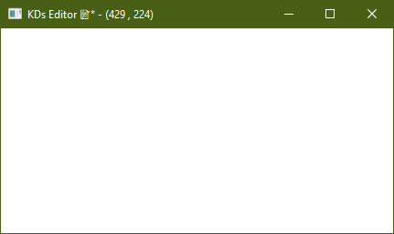

# Le titre qui informe

> ***Énoncé :***
Affichez dans le titre l'état de votre programme : le nom du document, un astérisque s'il est modifié, et la taille courante de la fenêtre. Mettez-le à jour au bon moment, pas à chaque image.

Le [code source](c3-exo5_main.cpp) permet d'afficher les modifications apportées aux dimensions de la fenêtre via une étoile qui est visible au niveau du titre lors de la modification. Par ailleurs, affiche aussi les dimensions actuelles.

J'utilise la fonction `ActualiserTitre(..)` pour actualiser la valeur du titre de la fenêtre pour qu'elle affiche en même temps les modifications :

```cpp
static void ActualiserTitre(NkWindow &window, const NkString &nomDocument, bool documentModifie)
{
    const auto taille = window.GetSize();

    const NkString titre = NkString::Format(
        "%s%s - (%u , %u)",
        nomDocument.CStr(),
        documentModifie ? "*" : "",
        taille.x,
        taille.y);

    window.SetTitle(titre);
}
```

En image, le résultat de l'exécution du projet :

[](image.png)
