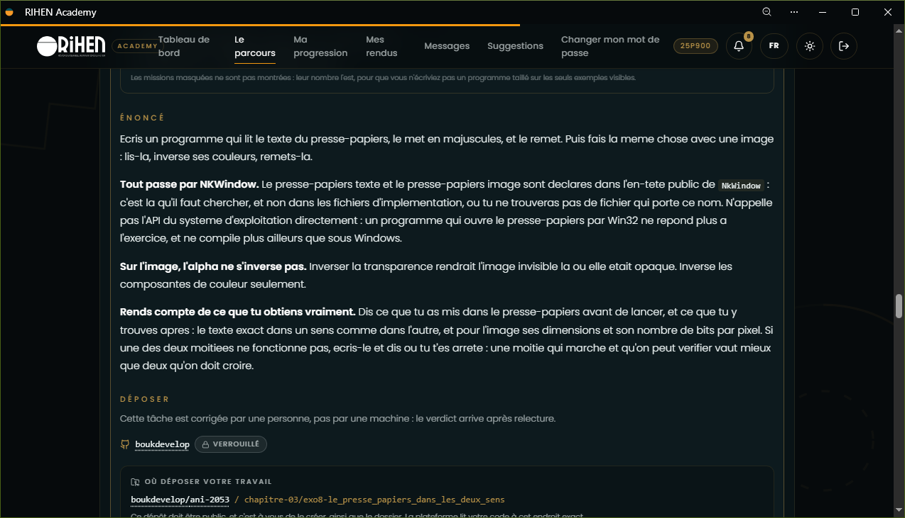

# Le presse-papiers, dans les deux sens

***Énoncé :***
> Ecris un programme qui lit le texte du presse-papiers, le met en majuscules, et le remet. Puis fais la meme chose avec une image : lis-la, inverse ses couleurs, remets-la.

> Tout passe par NKWindow. Le presse-papiers texte et le presse-papiers image sont declares dans l'en-tete public de NkWindow : c'est la qu'il faut chercher, et non dans les fichiers d'implementation, ou tu ne trouveras pas de fichier qui porte ce nom. N'appelle pas l'API du systeme d'exploitation directement : un programme qui ouvre le presse-papiers par Win32 ne repond plus a l'exercice, et ne compile plus ailleurs que sous Windows.

> Sur l'image, l'alpha ne s'inverse pas. Inverser la transparence rendrait l'image invisible la ou elle etait opaque. Inverse les composantes de couleur seulement.

> Rends compte de ce que tu obtiens vraiment. Dis ce que tu as mis dans le presse-papiers avant de lancer, et ce que tu y trouves apres : le texte exact dans un sens comme dans l'autre, et pour l'image ses dimensions et son nombre de bits par pixel. Si une des deux moitiees ne fonctionne pas, ecris-le et dis ou tu t'es arrete : une moitie qui marche et qu'on peut verifier vaut mieux que deux qu'on doit croire.

---

L'on ne parle plus du code de base utilisé et de ces methodes, pocédures et fonctions. Le plus important ici sont les fonctions :

* GetClipboardText();
* GetClipboardImage();
* SetClipboardText();
* SetClipboardImage();

Qui permettent respectivement, de chercher le contenu du presse-papier et de le retourner(Que se siot une image ou un texte).

---

Dans cette zone, on déclare des variables de types presse-papier Image et d'autre qui devront contenir le contenu du presse-papier :

```cpp
    NkClipboardImage image;
    const bool imageLue = window.GetClipboardImage(image);
    bool running = true;

    logger.Info("[texte avant]\n{0}", texteAvant.CStr());

    if (imageLue && image.IsValid())
    {
        logger.Info("[image avant] {0}x{1}",
                    image.width, image.height);
    }
    else
    {
        logger.Info("[image avant] aucune image lisible");
    }
```

Et ces différentes itérations sont là pour vérifier si le contenue du presse papier est bien une image, et si c'est bien le cas il est renvoyé un message donnant ses caractéristiques(dimensions). Sinon, un message d'erreur.

## Exemples

### Image en presse-papier

J'ai mis une image dans mon presse-papier , ainsi donc on peut voir dans le terminal :

```bash
PS C:\Users\FRANCK\Desktop\bouk\FirstWindow> jenga r

╔══════════════════════════════════════════════════════════════════╗
║                                                                  ║
║                ██╗███████╗███╗   ██╗ ██████╗  █████╗             ║
║                ██║██╔════╝████╗  ██║██╔════╝ ██╔══██╗            ║
║                ██║█████╗  ██╔██╗ ██║██║  ███╗███████║            ║
║           ██   ██║██╔══╝  ██║╚██╗██║██║   ██║██╔══██║            ║
║           ╚█████╔╝███████╗██║ ╚████║╚██████╔╝██║  ██║            ║
║            ╚════╝ ╚══════╝╚═╝  ╚═══╝ ╚═════╝ ╚═╝  ╚═╝            ║
║                                                                  ║
║             Multi-platform C/C++ Build System v2.8.0             ║
║                                                                  ║
╚══════════════════════════════════════════════════════════════════╝


━━━━━━━━━━━━━━━━━━━━━━━━━━━━━━━━━━━━━━━━━━━━━━━━━━━━━━━━━━━━━━━━━━━━━━━━━━━━━━━━
  ▶  EXECUTION  —  Window.exe
     C:\Users\FRANCK\Desktop\bouk\FirstWindow\Build\Bin\Debug-Windows\Window\Window.exe
━━━━━━━━━━━━━━━━━━━━━━━━━━━━━━━━━━━━━━━━━━━━━━━━━━━━━━━━━━━━━━━━━━━━━━━━━━━━━━━━

[2026-09-28 01:47:49.620] [INF] [default] [main.cpp:37 in nkmain] -> [texte avant]

[2026-09-28 01:47:49.635] [INF] [default] [main.cpp:41 in nkmain] -> [image avant] 1274x731
[2026-09-28 01:47:49.720] [INF] [default] [main.cpp:55 in nkmain] -> [texte apres ecriture]

[2026-09-28 01:47:49.855] [INF] [default] [main.cpp:73 in nkmain] -> [image apres ecriture] 1274x731
[2026-09-28 01:47:49.865] [INF] [default] [main.cpp:89 in nkmain] -> [texte final apres ecriture image]


━━━━━━━━━━━━━━━━━━━━━━━━━━━━━━━━━━━━━━━━━━━━━━━━━━━━━━━━━━━━━━━━━━━━━━━━━━━━━━━━
  ◀  FIN D'EXECUTION  —  termine normalement  (20.89s)
━━━━━━━━━━━━━━━━━━━━━━━━━━━━━━━━━━━━━━━━━━━━━━━━━━━━━━━━━━━━━━━━━━━━━━━━━━━━━━━━
```

### Texte en presse-papier :

Le texte pris pour cette situation est le texte de l'énoncé du TP en question :

Ici on utilise deux appels simples. Une pour mmontrer le texte avant écriture

```cpp
    logger.Info("[texte avant]\n{0}", texteAvant.CStr());
```

Et l'autre pour afficher le texte en écriture en majuscule

```cpp

    // Transformer le texte puis vérifier immédiatement ce que NkWindow relit.
    NkString texteMajuscule = texteAvant;
    texteMajuscule.ToUpper(); // Conversion ASCII.
    window.SetClipboardText(texteMajuscule);

    const NkString texteApres = window.GetClipboardText();
    logger.Info("[texte apres ecriture]\n{0}", texteApres.CStr());

```

---

Le code fonctionen de telle sorte à ce que, il regarde le presse-papier, le note le transforme en majuscule et le renvoie :

```bash
PS C:\Users\FRANCK\Desktop\bouk\FirstWindow> jenga r

╔══════════════════════════════════════════════════════════════════╗
║                                                                  ║
║                ██╗███████╗███╗   ██╗ ██████╗  █████╗             ║
║                ██║██╔════╝████╗  ██║██╔════╝ ██╔══██╗            ║
║                ██║█████╗  ██╔██╗ ██║██║  ███╗███████║            ║
║           ██   ██║██╔══╝  ██║╚██╗██║██║   ██║██╔══██║            ║
║           ╚█████╔╝███████╗██║ ╚████║╚██████╔╝██║  ██║            ║
║            ╚════╝ ╚══════╝╚═╝  ╚═══╝ ╚═════╝ ╚═╝  ╚═╝            ║
║                                                                  ║
║             Multi-platform C/C++ Build System v2.8.0             ║
║                                                                  ║
╚══════════════════════════════════════════════════════════════════╝


━━━━━━━━━━━━━━━━━━━━━━━━━━━━━━━━━━━━━━━━━━━━━━━━━━━━━━━━━━━━━━━━━━━━━━━━━━━━━━━━
  ▶  EXECUTION  —  Window.exe
     C:\Users\FRANCK\Desktop\bouk\FirstWindow\Build\Bin\Debug-Windows\Window\Window.exe
━━━━━━━━━━━━━━━━━━━━━━━━━━━━━━━━━━━━━━━━━━━━━━━━━━━━━━━━━━━━━━━━━━━━━━━━━━━━━━━━

[2026-09-28 01:58:30.668] [INF] [default] [main.cpp:37 in nkmain] -> [texte avant]
Enonce
Ecris un programme qui lit le texte du presse-papiers, le met en majuscules, et le remet. Puis fais la meme chose avec une image : lis-la, inverse ses couleurs, remets-la.

Tout passe par NKWindow. Le presse-papiers texte et le presse-papiers image sont declares dans l'en-tete public de NkWindow : c'est la qu'il faut chercher, et non dans les fichiers d'implementation, ou tu ne trouveras pas de fichier qui porte ce nom. N'appelle pas l'API du systeme d'exploitation directement : un programme qui ouvre le presse-papiers par Win32 ne repond plus a l'exercice, et ne compile plus ailleurs que sous Windows.

Sur l'image, l'alpha ne s'inverse pas. Inverser la transparence rendrait l'image invisible la ou elle etait opaque. Inverse les composantes de couleur seulement.

Rends compte de ce que tu obtiens vraiment. Dis ce que tu as mis dans le presse-papiers avant de lancer, et ce que tu y trouves apres : le texte exact dans un sens comme dans l'autre, et pour l'image ses dimensions et son nombre de bits par pixel. Si une des deux moitiees ne fonctionne pas, ecris-le et dis ou tu t'es arrete : une moitie qui marche et qu'on peut verifier vaut mieux que deux qu'on doit croire.
[2026-09-28 01:58:30.672] [INF] [default] [main.cpp:46 in nkmain] -> [image avant] aucune image lisible
[2026-09-28 01:58:30.676] [INF] [default] [main.cpp:55 in nkmain] -> [texte apres ecriture]
ENONCe
ECRIS UN PROGRAMME QUI LIT LE TEXTE DU PRESSE-PAPIERS, LE MET EN MAJUSCULES, ET LE REMET. PUIS FAIS LA MEME CHOSE AVEC UNE IMAGE : LIS-LA, INVERSE SES COULEURS, REMETS-LA.

TOUT PASSE PAR NKWINDOW. LE PRESSE-PAPIERS TEXTE ET LE PRESSE-PAPIERS IMAGE SONT DECLARES DANS L'EN-TETE PUBLIC DE NKWINDOW : C'EST LA QU'IL FAUT CHERCHER, ET NON DANS LES FICHIERS D'IMPLEMENTATION, OU TU NE TROUVERAS PAS DE FICHIER QUI PORTE CE NOM. N'APPELLE PAS L'API DU SYSTEME D'EXPLOITATION DIRECTEMENT : UN PROGRAMME QUI OUVRE LE PRESSE-PAPIERS PAR WIN32 NE REPOND PLUS A L'EXERCICE, ET NE COMPILE PLUS AILLEURS QUE SOUS WINDOWS.

SUR L'IMAGE, L'ALPHA NE S'INVERSE PAS. INVERSER LA TRANSPARENCE RENDRAIT L'IMAGE INVISIBLE LA OU ELLE ETAIT OPAQUE. INVERSE LES COMPOSANTES DE COULEUR SEULEMENT.

RENDS COMPTE DE CE QUE TU OBTIENS VRAIMENT. DIS CE QUE TU AS MIS DANS LE PRESSE-PAPIERS AVANT DE LANCER, ET CE QUE TU Y TROUVES APRES : LE TEXTE EXACT DANS UN SENS COMME DANS L'AUTRE, ET POUR L'IMAGE SES DIMENSIONS ET SON NOMBRE DE BITS PAR PIXEL. SI UNE DES DEUX MOITIEES NE FONCTIONNE PAS, ECRIS-LE ET DIS OU TU T'ES ARRETE : UNE MOITIE QUI MARCHE ET QU'ON PEUT VERIFIER VAUT MIEUX QUE DEUX QU'ON DOIT CROIRE.
[2026-09-28 01:58:30.686] [INF] [default] [main.cpp:89 in nkmain] -> [texte final apres ecriture image]
ENONCe
ECRIS UN PROGRAMME QUI LIT LE TEXTE DU PRESSE-PAPIERS, LE MET EN MAJUSCULES, ET LE REMET. PUIS FAIS LA MEME CHOSE AVEC UNE IMAGE : LIS-LA, INVERSE SES COULEURS, REMETS-LA.

TOUT PASSE PAR NKWINDOW. LE PRESSE-PAPIERS TEXTE ET LE PRESSE-PAPIERS IMAGE SONT DECLARES DANS L'EN-TETE PUBLIC DE NKWINDOW : C'EST LA QU'IL FAUT CHERCHER, ET NON DANS LES FICHIERS D'IMPLEMENTATION, OU TU NE TROUVERAS PAS DE FICHIER QUI PORTE CE NOM. N'APPELLE PAS L'API DU SYSTEME D'EXPLOITATION DIRECTEMENT : UN PROGRAMME QUI OUVRE LE PRESSE-PAPIERS PAR WIN32 NE REPOND PLUS A L'EXERCICE, ET NE COMPILE PLUS AILLEURS QUE SOUS WINDOWS.

SUR L'IMAGE, L'ALPHA NE S'INVERSE PAS. INVERSER LA TRANSPARENCE RENDRAIT L'IMAGE INVISIBLE LA OU ELLE ETAIT OPAQUE. INVERSE LES COMPOSANTES DE COULEUR SEULEMENT.

RENDS COMPTE DE CE QUE TU OBTIENS VRAIMENT. DIS CE QUE TU AS MIS DANS LE PRESSE-PAPIERS AVANT DE LANCER, ET CE QUE TU Y TROUVES APRES : LE TEXTE EXACT DANS UN SENS COMME DANS L'AUTRE, ET POUR L'IMAGE SES DIMENSIONS ET SON NOMBRE DE BITS PAR PIXEL. SI UNE DES DEUX MOITIEES NE FONCTIONNE PAS, ECRIS-LE ET DIS OU TU T'ES ARRETE : UNE MOITIE QUI MARCHE ET QU'ON PEUT VERIFIER VAUT MIEUX QUE DEUX QU'ON DOIT CROIRE.

━━━━━━━━━━━━━━━━━━━━━━━━━━━━━━━━━━━━━━━━━━━━━━━━━━━━━━━━━━━━━━━━━━━━━━━━━━━━━━━━
  ◀  FIN D'EXECUTION  —  termine normalement  (26.25s)
━━━━━━━━━━━━━━━━━━━━━━━━━━━━━━━━━━━━━━━━━━━━━━━━━━━━━━━━━━━━━━━━━━━━━━━━━━━━━━━━
```
